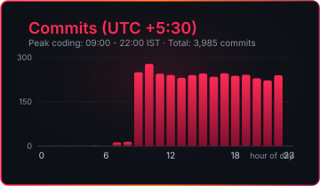

  

  

 

  

### `┌──(akash㉿nixos)-[~]`
### `└─$ whoami && neofetch`

  

 

### `┌──(akash㉿nixos)-[/var/log]`
### `└─$ tail -f life.log`

  

 

### `┌──(akash㉿nixos)-[~/stack]`
### `└─$ ls -la # 77 weapons`

  

 

### `┌──(akash㉿nixos)-[~/stats]`
### `└─$ htop --github`

  

 

### `┌──(akash㉿nixos)-[~/metrics]`
### `└─$ cat productive-hours.log`

  

 

### `┌──(akash㉿nixos)-[~/repo]`
### `└─$ git log --graph --3d`

  <picture>
    <source media="(prefers-color-scheme: dark)" srcset="profile-3d-contrib/profile-night-rainbow.svg"/>
    <source media="(prefers-color-scheme: light)" srcset="profile-3d-contrib/profile-green-animate.svg"/>
    
  </picture>

 

### `┌──(akash㉿nixos)-[~/services]`
### `└─$ systemctl status ai-ml-developer.service`

  

 

### `┌──(akash㉿nixos)-[~/scripts]`
### `└─$ python3 snake.py`

  <picture>
    <source media="(prefers-color-scheme: dark)" srcset="assets/snake-dark.svg"/>
    <source media="(prefers-color-scheme: light)" srcset="assets/snake.svg"/>
    
  </picture>

### `┌──(visitor@git)-[~]`
### `└─$ ssh akash@nixos`

  
  &nbsp;&nbsp;
  
  &nbsp;&nbsp;
  
  &nbsp;&nbsp;
  

 

  

 

  

 

  <code>logout</code> — connection to <b>nixos</b> closed · <code>exit 0</code>

  <b>🔥 "The Strongest Code is Forged in Flames" — Hanma Doctrine 🔥</b>

<i>Made with 🔥 NixOS · 🐧 Linux · ❤️ Code · <code>neovim</code> — <code>:wq</code></i>

